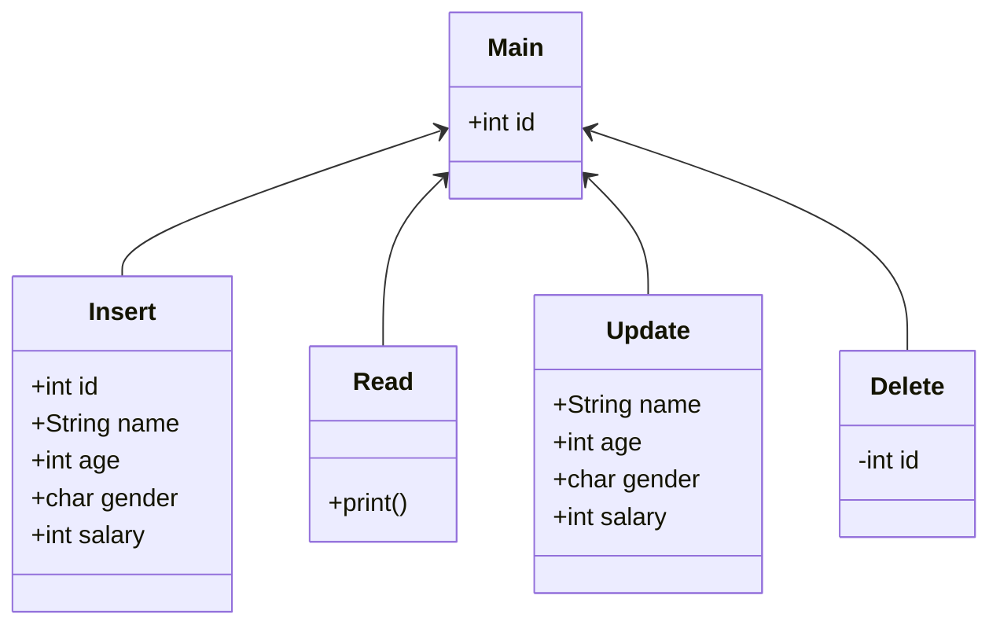

# Create-Retrieve-Update-Delete
**with sqlite**

### Diagram

```mermaid
classDiagram
class Main
Main <-- Insert
Main <-- Read
Main <-- Update
Main <-- Delete
Main: +int id
class Insert{
  +int id
  +String name
  +int age
  +char gender
  +int salary
}
class Read{
  +print()
}
class Update{
  +String name
  +int age
  +char gender
  +int salary
}
class Delete{
  -int id
}
```

### Prerequisite
``pip install -i requirements.txt``

