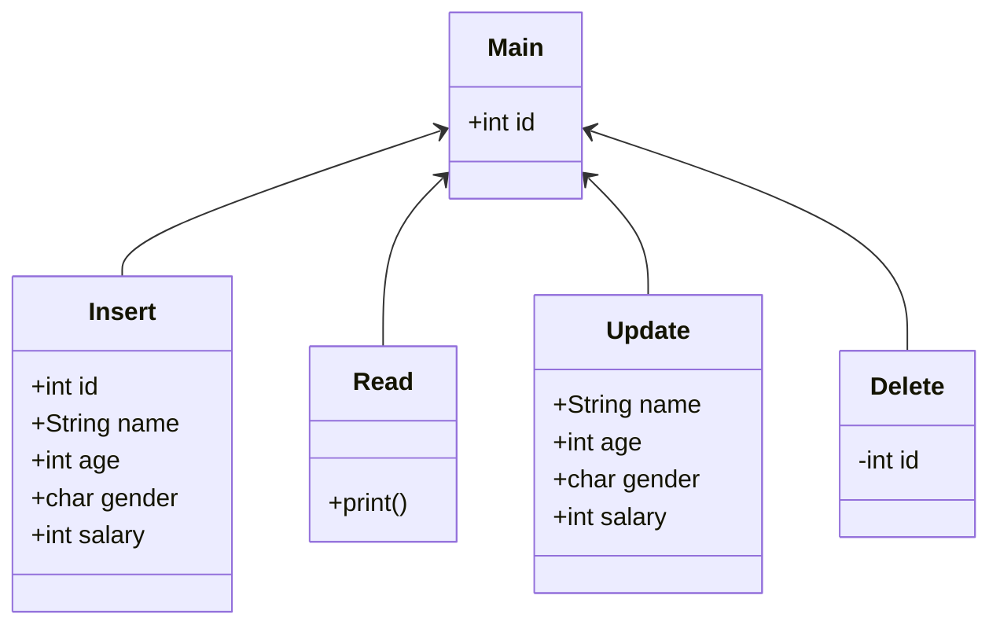

# Sqlite Create-Retrieve-Update-Delete

### Diagram

### How to run?

#### Python
``pip install --user sqlite &nbsp;
python3 crud.py``

#### Java
``java -classpath sqlite-jdbc-*.jar crud.java``

#### C++
``g++ crud.cpp -o out.crud.cpp &nbsp;
./out.crud.cpp``

#### C
``gcc crud.c -o out.crud.c &nbsp;
./out.crud.cpp``

