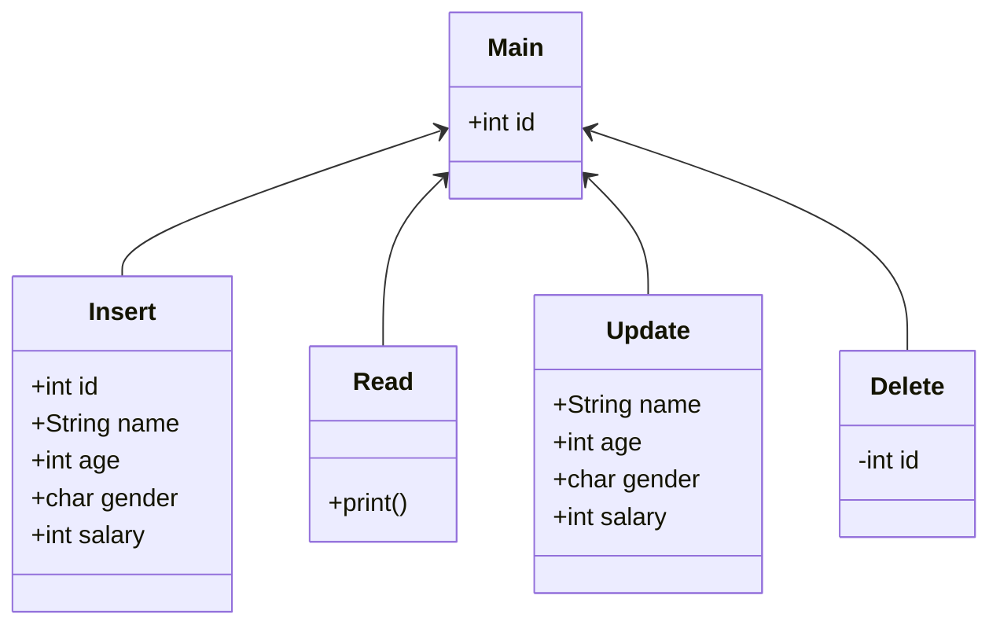

# Create-Retrieve-Update-Delete
**with sqlite**

### Diagram

### Prerequisite

#### Python
``pip install --user sqlite``
``python3 crud.py``

#### Java
``java -classpath crud.java``

#### C++
``g++ crud.cpp -o out.crud.cpp``
``./out.crud.cpp``

#### C
``gcc crud.c -o out.crud.c``
``./out.crud.cpp``

